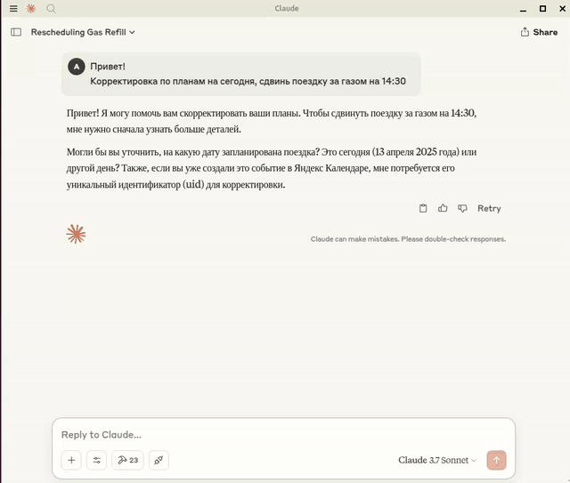

# Яндекс Календарь MCP для Claude

MCP-сервер для интеграции Яндекс Календаря с Claude через Model Context Protocol (MCP). Позволяет Claude просматривать, создавать и удалять события в вашем Яндекс Календаре.

## Демонстрация работы



*Демонстрация того, как Claude управляет Яндекс Календарем через MCP*

[Скачать полное видео демонстрации (MP4, 879 КБ)](media/Ya-Calendar-MCP-Demo.mp4)

## ⚠️ ВАЖНО! Требуется пароль приложения Яндекс ⚠️

> **Для работы с этим MCP-сервером необходимо создать специальный пароль приложения в Яндекс!**
> 
> 1. Перейдите на страницу [https://id.yandex.ru/security/app-passwords](https://id.yandex.ru/security/app-passwords)
> 2. Нажмите "Создать пароль приложения"
> 3. Выберите "Календарь" (CalDEV) в качестве приложения и дайте ему имя (например, "Claude-Calendar-MCP")
> 4. Скопируйте сгенерированный пароль и используйте его в файле `.env` или в конфигурации
> 
> ⚠️ **НЕ ИСПОЛЬЗУЙТЕ основной пароль от вашего аккаунта Яндекс!** ⚠️  
> Пароль приложения — это отдельный, ограниченный по возможностям ключ доступа.

## Возможности

- 📅 Просмотр предстоящих событий в календаре
- ➕ Создание новых событий в календаре
- 🗑️ Удаление существующих событий
- 📝 Вывод данных в текстовом или JSON формате

## Установка для Claude Desktop

### 1. Установите MCP SDK и зависимости

```bash
# Создайте и активируйте виртуальное окружение (рекомендуется)
python -m venv venv
source venv/bin/activate  # для Linux/Mac
# или
venv\Scripts\activate  # для Windows

# Установите MCP SDK и необходимые зависимости
pip install "mcp[cli]" httpx beautifulsoup4 caldav python-dotenv
```

### 2. Настройте учетные данные Яндекс Календаря

Создайте файл `.env` в корневой папке проекта со следующим содержимым:

```
YANDEX_CALDAV_URL=https://caldav.yandex.ru
YANDEX_USERNAME=ваш_логин@yandex.ru
YANDEX_PASSWORD=пароль_приложения_из_https://id.yandex.ru/security/app-passwords
```

### 3. Протестируйте MCP сервер (опционально)

```bash
# Запустите сервер в режиме разработки
mcp dev main.py
```

### 4. Установите сервер для использования с Claude Desktop

```bash
# Установите MCP-сервер для Claude Desktop
mcp install main.py --name "Яндекс Календарь"
```

Команда выше автоматически настроит MCP-сервер для работы с Claude Desktop. После этого вы можете открыть Claude Desktop и начать использовать интеграцию с Яндекс Календарем.

## Альтернативный способ настройки (вручную)

Если вы предпочитаете настроить интеграцию вручную, отредактируйте файл конфигурации Claude Desktop:

- macOS: `~/Library/Application Support/Claude/claude_desktop_config.json`
- Windows: `%APPDATA%\Claude\claude_desktop_config.json`
- Linux: `~/.config/Claude/claude_desktop_config.json`

Добавьте в него следующую конфигурацию:

```json
{
  "mcpServers": {
    "yandex-calendar": {
      "command": "/полный/путь/к/venv/bin/python",
      "args": [
        "/полный/путь/к/проекту/main.py"
      ],
      "env": {
        "YANDEX_CALDAV_URL": "https://caldav.yandex.ru",
        "YANDEX_USERNAME": "ваш_логин@yandex.ru",
        "YANDEX_PASSWORD": "пароль_приложения_из_https://id.yandex.ru/security/app-passwords"
      }
    }
  }
}
```

## Использование в Claude

После установки вы можете использовать следующие команды при общении с Claude (как показано в [демонстрационном видео](#демонстрация-работы)):

### Просмотр событий

```
Какие у меня предстоящие события в календаре?
```

или

```
Покажи мои встречи на следующую неделю
```

### Создание события

```
Создай встречу "Обсуждение проекта" на завтра в 15:00 продолжительностью 45 минут
```

### Удаление события

```
Удали встречу с идентификатором <event_uid>
```

## Доступные инструменты

- `get_upcoming_events`: Получение предстоящих событий на указанное количество дней
- `create_calendar_event`: Создание нового события в календаре
- `delete_calendar_event`: Удаление события по его идентификатору (UID)

## Разработка и расширение

Информация о Model Context Protocol (MCP):
- Официальная документация: https://modelcontextprotocol.io/introduction
- Примеры MCP-серверов: https://github.com/modelcontextprotocol/servers
- Статья про создание агентов: https://www.anthropic.com/engineering/building-effective-agents